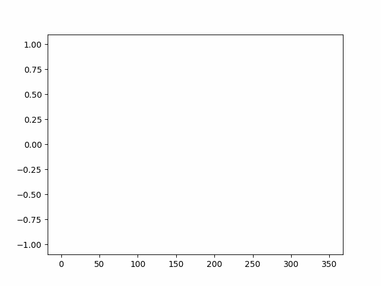

# Matplotlib 움직이는 Plot와 gif로 저장하기

데이터 처리를 하다보면 시계열과 같이 일정한 주기나 규칙으로 그래프를 업데이트하며 볼 필요가 있을 때가 있죠. 그래서 Matplotlib를 이용해서 일정한 주기로 그래프를 업데이트하여 애니메이션을 보여주는 방법과 그 결과를 gif로 저장하는 예제를 정리해 봤어요.

animated_image는 아래와 같아요.
- 참고로 imagemagick을 사용할 수 없으면 pillow로 자동 변경되어서 동작을 해요.

